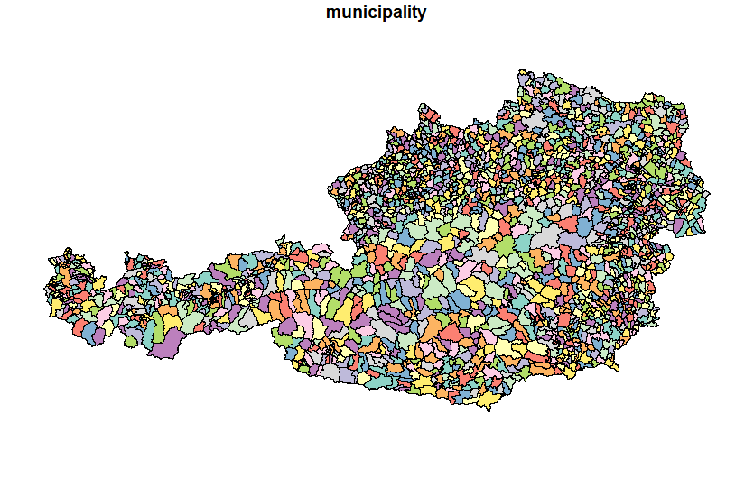
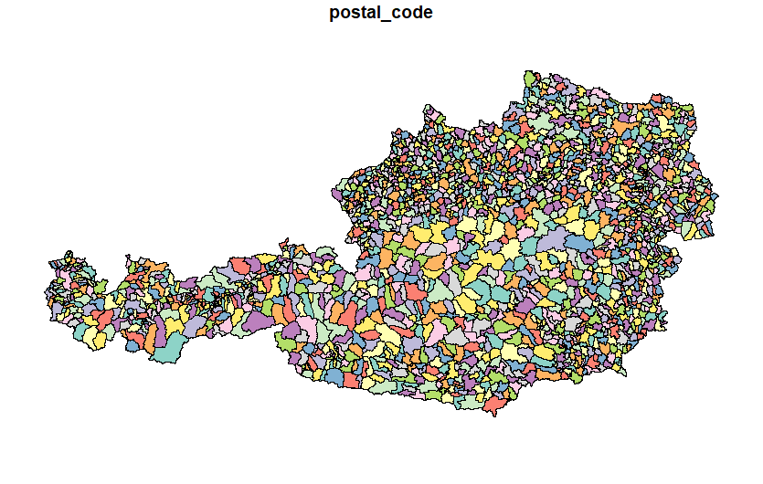

<meta name='keywords' content='Austria, Österreich, shapefile, python, geopandas, R, sf'>

# Austrian Shapefile

## Description

This repository aims to create and manipulate Austrian shapefile into multiple levels, such as state level (first-level administrative divisions of Austria), municipality level (third-level administrative divisions of Austria) and postal code level.  
The code was written in both Python and R; both codes are analogous.


## Output

Austrian shapefile - municipality level (third-level administrative divisions of Austria)

<p align="center">

</p>

Austrian shapefile - postal code level

<p align="center">

</p>


# Usage

## Python dependencies

```.ps1
python -m pip install geopandas matplotlib numpy pandas requests xlrd
```

## R dependencies

```.r
install.packages(c("readxl", "sf", "tidyverse"))
```


# See also

[Statistik Austria - Regionale Gliederungen](https://www.statistik.at/services/tools/services/regionales/regionale-gliederungen/)

[Statistik Austria - Division of Austria into Municipalities (Shapefile)](https://data.statistik.gv.at/web/meta.jsp?dataset=OGDEXT_GEM_1)
